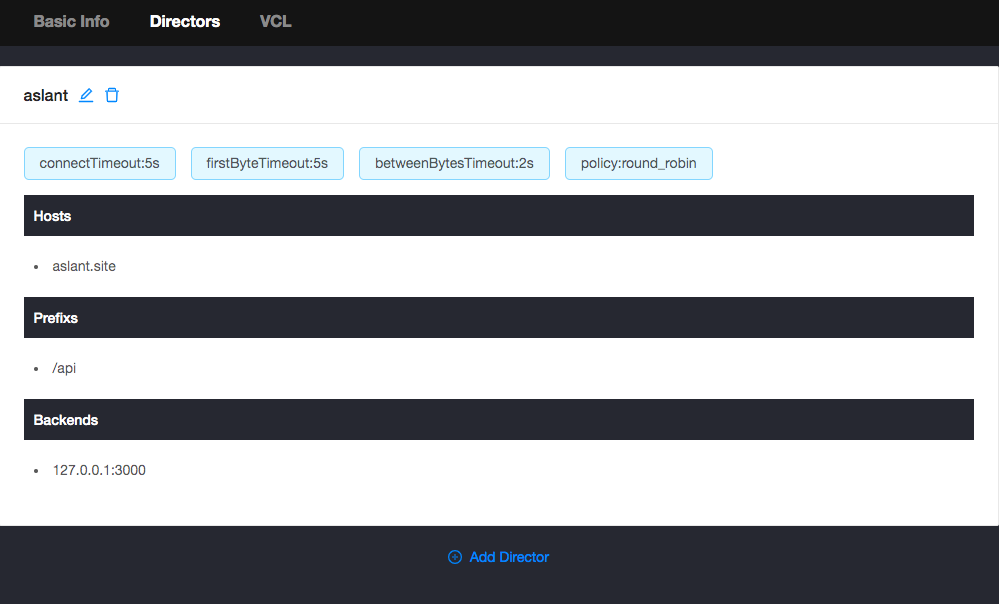

# varnish-agent

`varnish-agent`提供界面化的配置管理，配置信息保存于`etcd`中，当配置信息有更新时，自动更新配置并重新加载，方便多实例的配置管理。

需要注意，`varnish-agent`默认的`probe`如下：

```
probe basicProbe {
  .url = "/ping";
  .interval = 3s;
  .timeout = 5s;
  .window = 5;
  .threshold = 3;
}
```

所以对于backend都需要添加相应的health check处理（/ping），如果有需要自定义的，可以去调整`template.vcl`后，自行重新编译。

## 运行

参数说明：

- `CONFIG` 配置etcd的连接地址，此参数必须指定，如`CONFIG=etcd://192.168.31.176:2379/varnish-test`
- `ADDR` 配置agent的监听地址，默认为`:4000`
- `AUTH` agent的认证配置，如`AUTH=user:pwd`，如果不配置则不使用认证，建议指定此参数
- `PARAMS` varnish的启动参数，如`PARAMS="-a :8080 -s malloc,256m"`，需要注意的是，varnish的启动参数默认会添加`-F -p default_ttl=0`，而`-a`如果未指定，则指定为`:8080`，`-s`如果未指定，则指定为`malloc,1G`


在首次启动时，因为此时`etcd`中无相关配置信息，因此只会单独启动`agent`，其中4000为默认的agent监听端口，8080为varnish监听端口。

```bash
docker run -it --rm \
  -p 8080:8080 \
  -e CONFIG=etcd://192.168.31.176:2379/varnish-test \
  -e AUTH=user:pwd \
  vicanso/varnish-agent
```


### 添加director




在添加成功之后，需要重新启动，因为在添加第一个director之前，agent在无法获取director列表时，不会启动varnish，后续的调整则不再需要重启，会热更新其配置。

```bash
docker run -d --restart=always \
  -p 4000:4000 \
  -p 8080:8080 \
  -e CONFIG=etcd://192.168.31.176:2379/varnish-test \
  -e AUTH=user:pwd \
  vicanso/varnish-agent
```